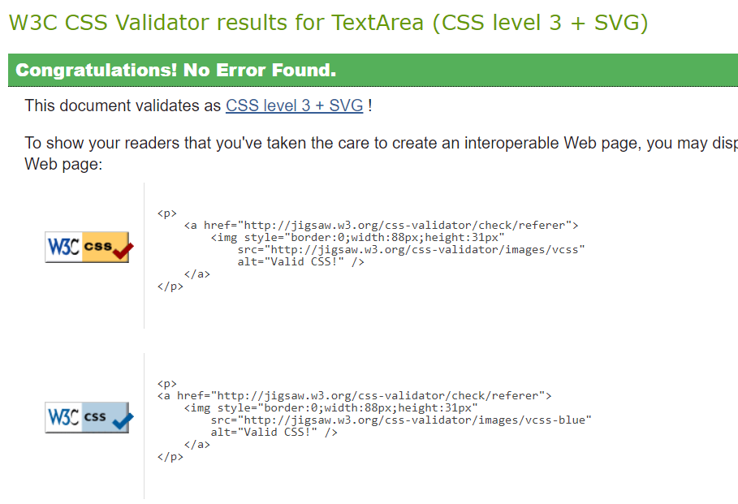
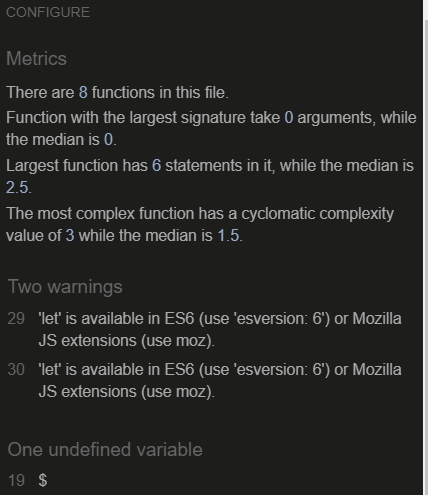
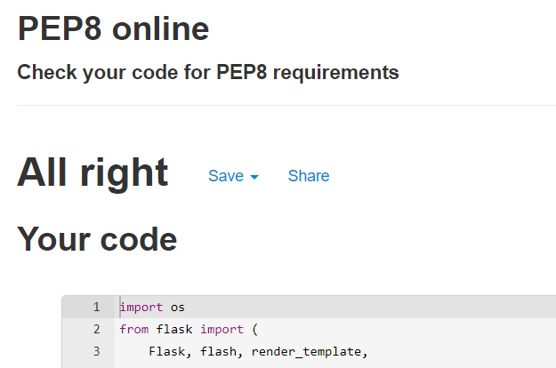

<h1 align="center">Testing Keto 4 Me</h1>

---

## Index 

- <a href="#validators">1. Code validators</a>
- <a href="#responsiveness">2. Responsiveness</a>
- <a href="#browser-compatibility">3. Browser compability</a>
- <a href="#user-stories">4. Testing user stories </a>
- <a href="#defensive-design">5. Defensive design</a>
- <a href="#bugs">5. Bugs</a>

---

<span id="validators"></span>

## 1. Code validators
 - **[HTML Validator](https://validator.w3.org/):** No errors to show.
    - With testing the HTML code, I had some syntax issues on all pages I build with jinja templating.
    - I tested the HTML code by running my server locally and used view page source. This code I passed through the validator.

    

- **[CSS Validator](https://jigsaw.w3.org/css-validator/):** No errors found.


- **[JS Hint](https://jshint.com/):** No errors found, two warnings, one undefined variable 
    - 2 warnings consist the notification: 'let' is available in ES6 (use 'esversion: 6') or Mozilla JS extensions (use moz).
    - 1 undefined variable: $<br>


- **[Python validator | PEP8](http://pep8online.com/):** No errors found



---

<span id="responsiveness"></span>

## 2. Responsiveness 
- Responsiveness of the game is tested with [Chrome DevTools](https://developers.google.com/web/tools/chrome-devtools) and [Responsive Design Checker](https://www.responsivedesignchecker.com/).
- The website is tested on the following devices: 
    - Desktop: 1024px, 1366px, 1440px, 1600px and 1680px. 
    - Mobile & Tablet: Galaxy S5, iPhone 5/SE, iPhone 6/7/8, iPhone 6/7/8 plus, iPhone x, iPad and  iPad Pro


### Notes
- The Favicon (the logo in next to the title) doesn't work on the profile page, recipes page, recipe pages, edit page and edit category page. I think this has to do with getting data from the db on these pages. I sources a link from w3schools as it was showing an error but when the new link is inserted these all disappear as a simple fix and no error now shows in the console. 

---

<span id="browser-compatibility"></span>

## 3. Browser compatibility


--- 

<span id="user-stories"></span>

## 4. Testing user stories 

### First-time visitor goals:
1. As a first time visitor, I want to be able to visit the website on every device, so that I can look at the website on desktop, mobile and tablet. 
    - The first time visitor can visite the website on a computer, laptop, tablet and phone.
2. As a first time visitor, I want to be able to navigate easily through the website, so I can find everything easily. 
    - The first time visitor can navigate through the website with the navbar and sidenav on mobile. The navbar is on top of the website. For the mobile visitors there is a hamburger menu that slides out. If the first time visitor will go to recipes, there is a list of all recipes and once clicked they open to view the full recipe. 
3. As a first time visitor, I want to see an overview of all recipes, so I can get inspired by all recipes.
    - The first time visitor can visit an overview of all recipes by clicking on the home page. On this page there is an overview of all recipes made. 
4. As a first time visitor, I want to be able to search recipes by ingredients, so I can quickly scan the recipes with these ingredients.(For example, I can search the word chicken and all recipes with the ingredient Chicken or chicken in the recipe name  or ingredients will appear.)
    - On the recipes pages there is a searchbar, where first time visitors can search for words. The search is based on the text of the recipe or the ingredients. 
5. As a first time visitor, I want to register an account on the website, so I can share my recipes on Keto 4 Me. 
    - The first time visitor can navigate to the signup page by clicking on register in the top navbar. If the first time visistor clicks on signup, they will navigate to the signup form on the website. 


### Site member goals
1. As a site member, I want to add my recipes, so I can share my recipes.
    - A site member can add recipes by clickng on 'New recipe' in the navbar or add new recipe on the profile page. Both ways lead to the add recipe form where site members can add a new recipe. 
2. As a site member, I want to edit my recipes, so I can update information in the recipe.
    - A site member has a profile page. On the profile page, there is an overview of all recipes made by the site member. By each recipe there is a edit button. If the site member clicks on the edit button they will navigate to the edit recipe form, where they can edit there recipe.
3. As a site member, I want to delete my recipes, so I can remove the recipe when it is no longer relevant. 
    - A site member can delete a recipe on the profile page. There is an overview of all recipes mede by the site member on the profile page. There is a button by each recipe, to delete the recipe. 
4. As a site member, I want to login to my profile, so I have access to my recipes. 
    - A site member can login by clicking on login at the top navbar on the website. 
5. As a site member, I want to logout to my profile, so I can logout from my profile. 
    - As a site member is logged in they can logout by clicking on logout at the top navbar.

### Admin goals
1. As an admin, I want to add new categories, so I can make the categories clear and manageable. 
    - The admin can add new categories by going to the category page and to click on add category.
2. As an admin, I want to edit categories, so I can update categories. 
    - The admin can edit categories by going to the category page and to click on edit category.
3. As an admin, I want to delete categories, so I can remove categories when they are no longer relevant. 
    - the admin can delete a categorie by going to the category page and to click on delete category.

---
<span id="defensive-design"></span>

## 5. Defensive design 

1. The user is not able to break the site by clicking on buttons. 

**Answer 1:** All buttons on the website work. The buttons on the website consist buttons that lead to other pages or submit buttons to add, edit or delete something from the database.

2. The signup form: 
    - 2.1 The username has to be between 5-15 characters
    - 2.2 The password has to be between 5-15 characters
        
3. The add and edit recipe form:
    - 3.1 The recipe name has to be between 1-20 characters and only must contain letters and numbers
    - 3.2 The category has to be chosen.
    - 3.3 The number of serves and prepping time has to be numbered.

**Answer 2 + 3 + 4:** 
The validation of all input fields is done with front end validation and by using the validate functionality from materialize. 

- The input fields between a number  of characters. This is done minlength, maxlength and the pattern attribute. 
- The input fields have a number of criteria. These criterias where set by the pattern attribute.
- The html type attribute is used to set for example numbers, text, email or url.
- The required functionality is used to make the input fields required. 

See below the input fields for front end validation
    
    ```
    login: 
    <input id="username" name="username" type="text" minlength="5" maxlength="15" pattern="^[a-zA-Z0-9]{5,15}$" class="validate" required>
    <input id="password" name="password" type="password" minlength="5" maxlength="15" pattern="^[a-zA-Z0-9]{5,15}$" class="validate" required>

    Add and edit recipe:
    <input id="recipe_name" pattern ="^[^-\s][\w\s-]+$" name="recipe_name" minlength="3" maxlength="50" type="text" class="validate" required>
    <select id="category_name" name="category_name" class="validate" required>
                        <option value="" disabled selected>Choose category for your recipe</option>
                        
                            <option value="{{ category.category_name }}">{{ category.category_name }}</option>
                        
                    </select>
                    <label for="category_name">Recipe Category</label>
    </select>
    <input id="image_url" name="image_url" minlength="5" maxlength="300" type="text" class="validate" required>
    <input id="serves" name="serves" pattern="^[1-9][0-9]*$" minlength="1" maxlength="3" type="text" class="validate" required>
    <input id="prep_time" name="prep_time" pattern="^[1-9][0-9]*$" minlength="1" maxlength="10" type="text" class="validate" required>
    ``` 

5. A recipe or category can't be deleted by just one click. If someone clicks on the delete button, there wil be a pop up with a confirmation if someone is sure to delete the recipe or category.

**Answer 5:** If someone clicks on the delete button, a message will pop up with the text: Are you sure you want to delete. If the user clicks again on delete the recipe or category will be deleted from the database.

--- 

<span id="bugs"></span>

## 6. Bugs | Solved
1. When nearing completion users were able to force themselves to login again and register again. This was solved and is no longer the case. 
2. A bug was found when adding a recipe. The method would indent a number of spaces for input. This was fixed by changing the textarea closing bracket 
3. The edit and delete buttons where not appearing inline. Again fixed with the use of divs.

---

[Go to README.md file](README.md).